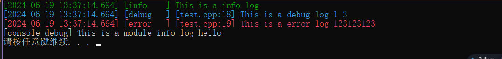

# useSpdlog
- only a head  to use spdlog，一个头文件使用spdlog
- csdn: https://blog.csdn.net/qq_16952303/article/details/139794754
- 

# how to use
1. git clone https://github.com/zhuqiang00099/useSpdlog.git
2. 将exspdlog拷贝到你自己的工程里面
3. 在cmake中包含exspdlog路径

# test.cpp

```cpp
#include "exspdlog/useSpdlog.h"
int main()
{
    //下面这一段写到程序初始化的地方，只能执行一次
    useSpdlog::config()->global_debug_logger_path = "logs/debug_global.log";
    useSpdlog::config()->global_error_logger_path = "logs/error_global.log";
    useSpdlog::config()->global_info_logger_path = "logs/info_global.log";
    useSpdlog::config()->default_save_days = 15;
    useSpdlog::initSpdlog(spdlog::level::debug);

    //增加控制台模块日志
    spdlog::register_logger(useSpdlog::createAsyncRotatingFileLogger(spdlog::level::debug,"console_debug", "logs/module1.log",true,false,"[console debug] %v"));

    //打印日志，fmt风格
    //如果要用printf风格，把#define USE_FMT_LOG注释掉
    LOG_INFO("This is a info log");
    LOG_DEBUG("This is a debug log {} {}",1,3.0f);
    LOG_ERROR("This is a error log {}","123123123");
    //模块日志
    MODULE_LOG_INFO("console_debug","This is a module info log {}","hello");

   
    return 0;
}
```
# 求关注，分享C++，机器视觉，编码等方面
- 微信公众号小朱玩CV示例代码，欢迎关注微信公众号：小朱玩CV
- 